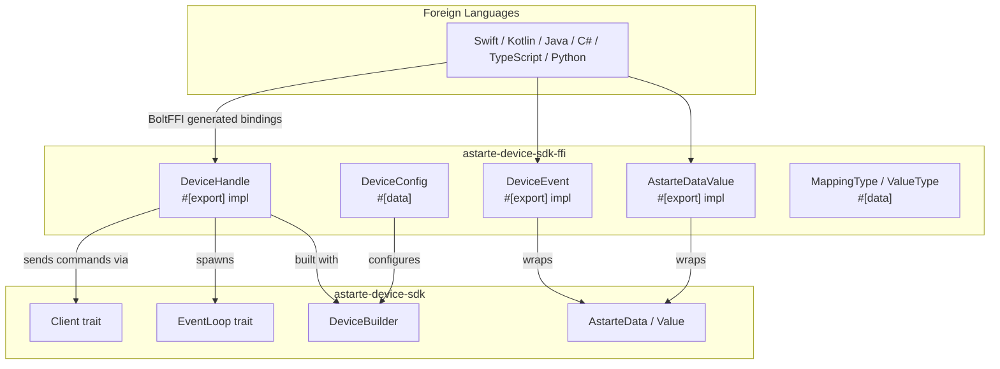

# BoltFFI Bindings for astarte-device-sdk-rust

## Goal

Create a new `astarte-device-sdk-ffi` crate that exposes the Astarte Device SDK's core functionality (connecting, sending data, receiving events, and accessing properties) through BoltFFI-generated multi-language bindings (Swift, Kotlin, Java, C#, TypeScript/WASM, Python).

## Background

Two previous FFI binding attempts exist:
- **Branch `push-toxptonwlrsp`**: Manual C bindings using `#[no_mangle]` + `repr(C)` + `cbindgen` + `typeshare`
- **Branch `push-xtsotrklzosp`**: Diplomat-based bindings with `#[diplomat::opaque]`

Both approaches share similar data models (device config, mapping types, value types, event structs) but differ in their FFI mechanism. This plan **unifies** the common patterns from both into a single crate using **BoltFFI** (`#[data]` / `#[export]`), which auto-generates native bindings for Swift, Kotlin, Java, C#, TypeScript, and Python.

## User Review Required

> [!IMPORTANT]
> BoltFFI requires a **tokio runtime** for async operations. Since the SDK uses tokio internally (for MQTT, channels), we need to embed a tokio runtime inside the `DeviceHandle` class. This matches the approach from both prior branches but is managed within BoltFFI's async model.

> [!IMPORTANT]
> BoltFFI classes must use `&self` (not `&mut self`) for thread safety. To achieve this without locking overhead, the `DeviceHandle` will store a `DeviceClient` and clone it locally when dispatching calls, as cloning the SDK client is lightweight and bypasses the `&mut self` limitation.

> [!WARNING]
> The `AstarteData::Double` variant wraps a custom `Double` newtype, not a raw `f64`. The FFI layer must validate the variant received from the calling language and return a structured error if conversion/validation fails.

## Proposed Changes

### FFI Crate

#### [NEW] [Cargo.toml](file:///home/luca/Work/SecoMind/Public/astarte/sdks/rust/astarte-device-sdk-rust/astarte-device-sdk-ffi/Cargo.toml)

New crate with:
- `crate-type = ["staticlib", "cdylib"]` (required by BoltFFI)
- Dependencies: `astarte-device-sdk` (workspace), `boltffi`, `tokio` (rt-multi-thread), `url`, `tracing`
- Workspace member registration

#### [NEW] [boltffi.toml](file:///home/luca/Work/SecoMind/Public/astarte/sdks/rust/astarte-device-sdk-rust/astarte-device-sdk-ffi/boltffi.toml)

BoltFFI configuration file for packaging targets.

#### [NEW] [src/lib.rs](file:///home/luca/Work/SecoMind/Public/astarte/sdks/rust/astarte-device-sdk-rust/astarte-device-sdk-ffi/src/lib.rs)

Main FFI module that re-exports the submodules.

#### [NEW] [src/types.rs](file:///home/luca/Work/SecoMind/Public/astarte/sdks/rust/astarte-device-sdk-rust/astarte-device-sdk-ffi/src/types.rs)

BoltFFI data types (records/enums) mapping Astarte types across the FFI boundary:

- **`DeviceConfig`** (`#[data]`): Configuration record with fields: `realm`, `device_id`, `credential_secret`, `pairing_url`, `interfaces_dir`, `writable_dir` (optional), `sqlite_db_path` (optional), and `ignore_ssl_errors` (bool). Unified from both branches' config structs. If `sqlite_db_path` is provided, the FFI builds with `SqliteStore`, otherwise it defaults to `MemoryStore` for property persistence.

- **`MappingType`** (`#[data]`): Enum mirroring `AstarteData` variants — `Double`, `Integer`, `Boolean`, `LongInteger`, `String`, `BinaryBlob`, `DateTime`, `DoubleArray`, `IntegerArray`, `BooleanArray`, `LongIntegerArray`, `StringArray`, `BinaryBlobArray`, `DateTimeArray`. Present in both branches (as `CMappingType` / `DeviceMappingType`).

- **`ValueType`** (`#[data]`): Enum — `Individual`, `Object`, `PropertySet`, `PropertyUnset`. Combines the manual branch's `CValueType` with the diplomat branch's `DeviceValueType`.

- **`StoredProperty`** (`#[data]`): Record with `interface: String`, `path: String`, `value: AstarteDataValue`. For property retrieval results.

#### [NEW] [src/data.rs](file:///home/luca/Work/SecoMind/Public/astarte/sdks/rust/astarte-device-sdk-rust/astarte-device-sdk-ffi/src/data.rs)

`AstarteDataValue` class (`#[export]`) wrapping `AstarteData`:

- **Constructors**: `from_double(f64)`, `from_integer(i32)`, `from_boolean(bool)`, `from_long_integer(i64)`, `from_string(&str)`, `from_binary_blob(Vec<u8>)`, `from_datetime_millis(i64)`, and array variants.
- **Accessors**: `get_type() -> MappingType`, `as_double() -> Option<f64>`, `as_integer() -> Option<i32>`, `as_boolean() -> Option<bool>`, `as_long_integer() -> Option<i64>`, `as_string() -> Option<String>`, `as_binary_blob() -> Option<Vec<u8>>`, `as_datetime_millis() -> Option<i64>`, and array accessor equivalents.
- Internal conversion to/from `AstarteData` with validation (e.g., NaN/Inf rejection for doubles).

This unifies the manual branch's `CAstarteData` and the diplomat branch's `DeviceIndividualValue`.

#### [NEW] [src/event.rs](file:///home/luca/Work/SecoMind/Public/astarte/sdks/rust/astarte-device-sdk-rust/astarte-device-sdk-ffi/src/event.rs)

`DeviceEvent` class (`#[export]`):

- **Accessors**: `interface() -> String`, `path() -> String`, `value_type() -> ValueType`, `as_individual() -> Option<IndividualEvent>`, `as_object() -> Option<ObjectEvent>`, `as_property() -> Option<AstarteDataValue>` (None if unset).

`IndividualEvent` class (`#[export]`):
- `data() -> AstarteDataValue`, `timestamp_millis() -> i64`

`ObjectEvent` class (`#[export]`):
- `keys() -> Vec<String>`, `get(key: &str) -> Option<AstarteDataValue>`, `timestamp_millis() -> i64`

This unifies the manual branch's `CValue` / getter functions with the diplomat branch's `ReceiveEvent` / `DeviceIndividualValue`.

#### [NEW] [src/device.rs](file:///home/luca/Work/SecoMind/Public/astarte/sdks/rust/astarte-device-sdk-rust/astarte-device-sdk-ffi/src/device.rs)

`DeviceHandle` class (`#[export]`) — the central API:

- **Constructor**: `async connect(config: DeviceConfig) -> Result<DeviceHandle, DeviceError>` — creates a tokio runtime, builds the device via `DeviceBuilder`, spawns the event loop, and returns a handle. Unifies both branches' connect logic.

- **Send methods**:
  - `async send_individual(&self, interface: &str, path: &str, data: &AstarteDataValue) -> Result<(), DeviceError>`
  - `async send_individual_with_timestamp(&self, interface: &str, path: &str, data: &AstarteDataValue, timestamp_millis: i64) -> Result<(), DeviceError>`
  - `async send_object(&self, interface: &str, path: &str, data: Vec<ObjectEntry>) -> Result<(), DeviceError>` (where `ObjectEntry` is `#[data]` with `key: String, value: AstarteDataValue`)
  - `async set_property(&self, interface: &str, path: &str, data: &AstarteDataValue) -> Result<(), DeviceError>`
  - `async unset_property(&self, interface: &str, path: &str) -> Result<(), DeviceError>`

- **Receive method**:
  - `async recv(&self) -> Result<DeviceEvent, DeviceError>` — receives the next event from the Astarte connection. Exposes the `Client::recv()` method.

- **Property access**:
  - `async get_property(&self, interface: &str, path: &str) -> Result<Option<AstarteDataValue>, DeviceError>`

- **Lifecycle**:
  - `async disconnect(&self) -> Result<(), DeviceError>`

Internal structure: wraps a tokio `Runtime` + the SDK `DeviceClient` + a `JoinHandle` for the event loop task. Clones the `DeviceClient` for each method dispatch to satisfy BoltFFI's `&self` requirement while providing identical functionality.

#### [NEW] [src/error.rs](file:///home/luca/Work/SecoMind/Public/astarte/sdks/rust/astarte-device-sdk-rust/astarte-device-sdk-ffi/src/error.rs)

Uses BoltFFI's `#[error]` macro on enums to expose natively throwable and structured errors in the calling languages. Separated by scope:

- **`ValueError`** (`#[error]`): Errors related to converting data payloads (e.g., `DoubleConversionFailed` for `NaN` or `Inf`).
- **`DeviceError`** (`#[error]`): Defines specific connection/sending variants:
  - `NotConnected`
  - `SendFailed(String)`
  - `ReceiveFailed(String)`
  - `ConfigurationError(String)`
  - `FatalError(String)`

These errors will map nicely to `Exception` (Java/Kotlin/Python/C#) and `Error` (Swift).

---

### Workspace Config

#### [MODIFY] [Cargo.toml](file:///home/luca/Work/SecoMind/Public/astarte/sdks/rust/astarte-device-sdk-rust/Cargo.toml)

- Add `"astarte-device-sdk-ffi"` to workspace members
- Add `boltffi` to workspace dependencies

---

## Architecture Diagram

## Verification Plan

### Automated Tests
1. `cargo check -p astarte-device-sdk-ffi` — ensures the crate compiles
2. `cargo test -p astarte-device-sdk-ffi` — unit tests for type conversions
3. `cargo build -p astarte-device-sdk-ffi` — ensures staticlib/cdylib build succeeds

### Manual Verification
- Run `boltffi init` + `boltffi pack python` to verify Python bindings generate correctly
- Test with a simple Python script connecting to an Astarte instance (if available)
